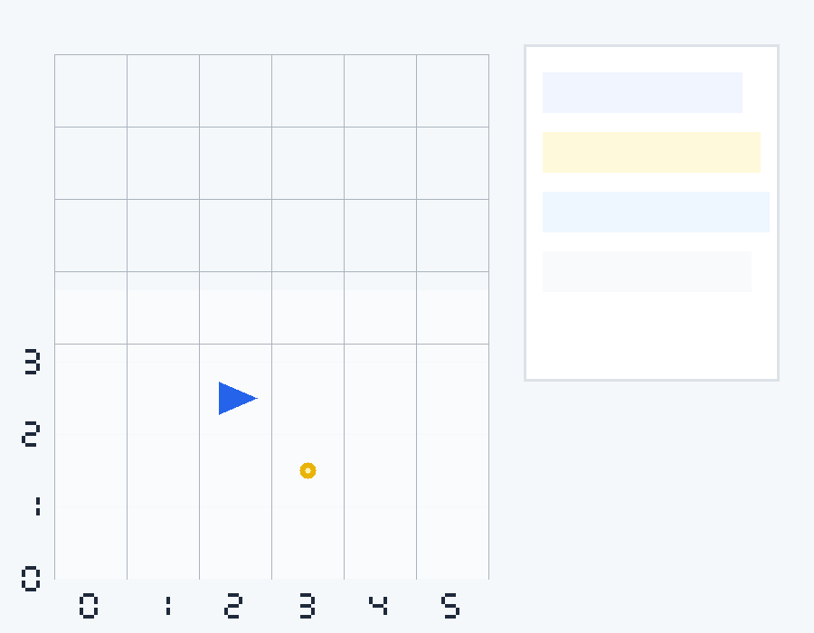

# Robot Lost 作業說明



## 功能清單

- pygame 格子地圖顯示
- 機器人位置、方向、ALIVE/LOST 狀態顯示
- `scent` 視覺化顯示
- `L / R / F` 逐步執行指令
- `N` 建立新機器人且保留 `scent`
- `C` 清除 `scent`
- `P` 逐步回放歷史快照

## 執行方式

- Python 版本：3.11+（本機實測 3.14）
- 安裝 pygame：`pip install pygame`
- 啟動遊戲：`python robot_game.py`

## 測試方式

- 執行指令：`python -m unittest discover -s tests -p "test_*.py" -v`
- 目前共有 15 個測試，覆蓋旋轉、越界、LOST、scent、非法指令與 UVA 118 經典案例

## 資料結構選擇理由

1. `Robot` 使用 `dataclass`：讓位置、方向、是否 LOST 的狀態集中管理，測試也容易比較。
2. `scent` 使用 `set[tuple[int, int, str]]`：查詢同一個 `(x, y, dir)` 是否已有危險標記是 O(1)。
3. 方向使用固定陣列 `['N', 'E', 'S', 'W']`：左轉右轉只需要索引加減，邏輯比一堆 `if` 更穩定。

## 一個踩到的 bug 與修正

一開始只想把 `scent` 記成 `(x, y)`，但這會讓同一格不同方向共用保護，造成規則錯誤。後來改成 `(x, y, dir)`，才能符合題目要求的「同位置 + 同方向」才忽略危險 `F`。

## 回放方式

本作業提供等效回放機制，不輸出 GIF。每次操作後會儲存快照，按 `P` 可循環查看每一步的狀態。

## 專案結構

```text
robot_core.py        核心規則，無 pygame 依賴
robot_game.py        pygame 互動畫面
tests/               單元測試
TEST_CASES.md        測資設計
TEST_LOG.md          Red/Green 測試紀錄
AI_USAGE.md          AI 使用說明
assets/gameplay.png  遊玩畫面截圖
```